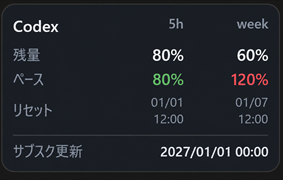

# Usage Widget for Codex

Codexの5時間枠・週間枠を、Windowsデスクトップに常駐表示するウィジェットです。

> **非公式** — OpenAIによる提供・承認・サポートを受けた製品ではありません。



## 画面表示の補足

- **ペース** — 今の使い方を続けた場合の予測消費率。100%超なら、リセット前に使い切る見込み
- **サブスク更新** — 手入力。毎月同じ日時へ自動更新し、存在しない日付は月末に補正

## 利用条件

- **OS** — Windows 10/11（x64）
- **Codex** — アプリまたはCLIをインストールし、ログイン済みであること
- **.NET** — Release版には同梱済み。追加インストール不要

## インストール

1. **ダウンロード** — [v1.0.0 Release](https://github.com/snsnsnsnsn/usage-widget-for-codex/releases/tag/v1.0.0)から `CodexUsageWidget.exe` を取得
2. **配置** — EXEを固定フォルダーへ移動
3. **起動** — EXEを実行

## 操作上の注意

- **設定** — ウィジェットまたは通知領域アイコンを右クリック
- **クリック透過** — 通知領域アイコンから解除可能
- **EXEの移動** — 自動起動を一度解除し、移動後に再設定
- **SmartScreen** — コード未署名のため、初回に警告が出る場合あり

## データの取得とプライバシー

- **取得元** — ログイン済みの公式Codex
- **認証** — Codexに任せ、APIキーやログイン情報は保存しない
- **取得できない場合** — PC内のCodex記録から利用制限だけを読む
- **会話内容** — ウィジェットでは保存・表示・外部送信しない

## アンインストール

- **本体** — 自動起動を解除し、アプリを終了してEXEを削除
- **設定** — 必要なら `%LOCALAPPDATA%\CodexUsageWidget` を削除

## ビルド

- **必要環境** — .NET 8 SDKまたはVisual Studio 2022

```powershell
dotnet build .\CodexUsageWidget.sln -c Release
dotnet run --project .\CodexUsageWidget.Tests -c Release
.\build-release.ps1
```

## ライセンス

[MIT License](LICENSE)
